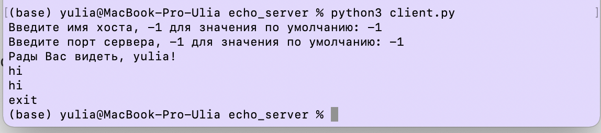

## Простейшие TCP-клиент и эхо-сервер

### Цель работы

Познакомиться с приемами работы с сетевыми сокетами в языке программирования Python.

### Задания для самостоятельного выполнения

3. Модифицируйте код сервера таким образом, чтобы при разрыве соединения клиентом он продолжал слушать данный порт и, таким образом, был доступен для повторного подключения.

4. Модифицируйте код клиента и сервера таким образом, чтобы номер порта и имя хоста (для клиента) они спрашивали у пользователя. Реализовать безопасный ввод данных и значения по умолчанию.

5. Модифицировать код сервера таким образом, чтобы все служебные сообщения выводились не в консоль, а в специальный лог-файл.

6. Модифицируйте код сервера таким образом, чтобы он автоматически изменял номер порта, если он уже занят. Сервер должен выводить в консоль номер порта, который он слушает.

7. Реализовать сервер идентификации. Сервер должен принимать соединения от клиента и проверять, известен ли ему уже этот клиент (по IP-адресу). Если известен, то поприветствовать его по имени. Если неизвестен, то запросить у пользователя имя и записать его в файл. Файл хранить в произвольном формате.

8. Реализовать сервер аутентификации. Похоже на предыдущее задание, но вместе с именем пользователя сервер отслеживает и проверяет пароли. Дополнительные баллы за безопасное хранение паролей. Дополнительные баллы за поддержание сессии на основе токена наподобие cookies

9. Напишите вспомогательные функции, которые реализуют отправку и принятие текстовых сообщений в сокет. Функция отправки должна дополнять сообщение заголовком фиксированной длины, в котором содержится информация о длине сообщения. Функция принятия должна читать сообщение с учетом заголовка. В дополнении реализуйте преобразование строки в байтовый массив и обратно в этих же функциях. Дополнително оценивается, если эти функции будут реализованы как унаследованное расширение класса socket библиотеки socket.

10. Дополните код клиента и сервера таким образом, чтобы они могли посылать друг другу множественные сообщения один в ответ на другое.

